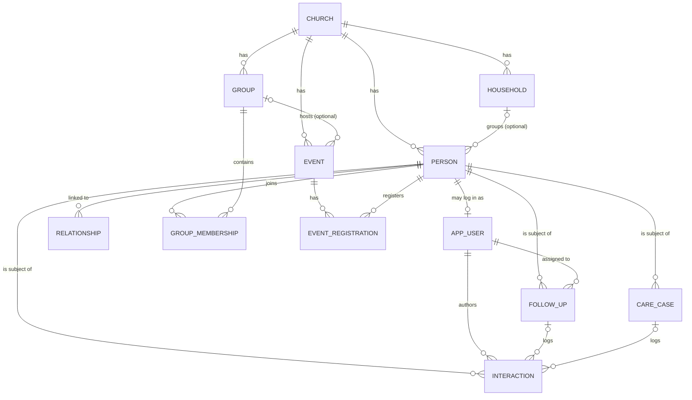

# Unity — Database Model v1

Scope: MVP three pillars — **People directory**, **Newcomer follow-up**, **Events + registration/check-in** — plus the care/prayer entity needed by the follow-up flow. Designed to translate 1:1 into Django models on Postgres.

Source requirements: "Unity DB model" sheet, "UI requirements notes", "High-level functional requirement notes" (Google Drive, 2026-07).

## Conventions

- Every domain table carries `church_id` (FK → `church`). Single-tenant deployment today; this is the cheap insurance for later productization. All unique constraints and queries are scoped by it.
- All tables: `id` (bigint PK), `created_at`, `updated_at`.
- Routine removal uses deactivate/anonymize rules from #30. Hard deletion is admin-only and audited from M0.
- Enums are Django `TextChoices` (stored as short strings, not ints).
- Names: `snake_case` tables/columns, singular entity names.

## Out of scope (deliberately)

Giving/payments (use Tithe.ly/Pushpay links), communication hub, sentiment analysis, facial recognition, analytics warehouse, multilingual content, member-facing consent management, recurring-event rules (create individual events for MVP; add `rrule` later). Basic audit and consent records are M0 requirements; see #27 and #28.

---

## ER overview

---

## 1. church

Tenant root. One row at launch.

| column | type | notes |
|---|---|---|
| name | varchar(200) | |
| timezone | varchar(50) | IANA, e.g. `Australia/Sydney` |
| locale | varchar(10) | default `en-AU` |

## 2. person

The central entity. Everyone is a `person` — visitors, members, staff. Login is separate (`app_user`).

| column | type | notes |
|---|---|---|
| church_id | FK church | indexed |
| full_name | varchar(200) | required |
| preferred_name | varchar(100) | nullable |
| gender | enum | `male` / `female` / `unspecified` |
| date_of_birth | date | nullable — store DOB, never age |
| email | varchar(254) | nullable, unique per church when set |
| phone | varchar(30) | nullable; E.164 |
| has_whatsapp | boolean | default true — primary contact channel |
| photo_url | url (varchar 500) | nullable — plain URL, no in-app file storage for MVP |
| home_country | varchar(2) | ISO 3166-1, nullable |
| suburb | varchar(100) | nullable — suburb-level only; full street address is not needed for MVP and reduces data-breach blast radius |
| occupation | varchar(200) | nullable |
| university | varchar(200) | nullable (e.g. UTS, USYD) |
| course | varchar(200) | nullable |
| interests | jsonb (list of strings) | free tags for MVP; promote to `interest` M2M table if matching features arrive |
| household_id | FK household, nullable | family grouping — directory "by family" filters and future child check-in depend on it |
| membership_status | enum | `visitor` / `newcomer` / `regular` / `member` / `inactive` |
| discipleship_stage | enum, nullable | `pre_evangelism` / `evangelism` / `conversion` / `maturity` / `leadership` — staff-assessed, never self-served |
| faith_background | varchar(100), nullable | **sensitive** — see privacy note |
| invited_by_id | FK person, nullable | who brought them; feeds follow-up |
| notes | text | general staff notes (non-pastoral; pastoral notes live in `interaction`/`care_case`) |

**Privacy note:** `faith_background`, `discipleship_stage`, and everything in `care_case` are special-category data. MVP mitigations: field-level access — serializers expose them only to `role in (pastor, admin)`; encrypted at rest via Postgres disk encryption; excluded from any CSV export. Requirement-sheet traceability: *Religion* → `faith_background` (renamed, narrower pastoral meaning); *race/ethnicity* — **deliberately not modeled**, no MVP feature needs it and collecting it is pure liability; revisit only with a concrete feature and a consent flow.

**M0 requirement:** serializer-level gating alone is not sufficient because Django Admin, management commands, or raw ORM queries can bypass it. #31 must define and test query-, object- and field-level permission boundaries before real member data is used.

Indexes: `(church_id, full_name)`, `(church_id, membership_status)`.

## 3. relationship

From the sheet's "Friends with". Symmetric-ish social edge; `invited_by` on `person` covers the evangelism edge separately.

| column | type | notes |
|---|---|---|
| church_id | FK church | |
| from_person_id | FK person | |
| to_person_id | FK person | |
| kind | enum | `friend` / `family` / `spouse` / `guardian` — guardian is the parent/child edge child check-in will need (post-MVP) |

Constraints: `unique (from_person_id, to_person_id, kind)`, check `from_person_id < to_person_id` (store one row per pair; canonicalize order in `save()`). Indexes: `(church_id, from_person_id)`, `(church_id, to_person_id)` — "friends of X" queries both columns.

## 4. app_user

Django authentication identity + access profile. Most `person` rows never get one — only staff/leaders log in for MVP. The exact custom User / ChurchMembership shape must be resolved in #26 before the first production migration; the table below records the current placeholder, not a final decision.

| column | type | notes |
|---|---|---|
| user | OneToOne → auth.User | |
| person_id | OneToOne → person | required — church derived via `person.church_id` (no duplicate `church_id` column; avoids divergence) |
| role | enum | `admin` / `pastor` / `leader` / `member` |

Role gates (enforced in views/serializers, not DB):
- `admin` — everything incl. destructive ops
- `pastor` — all people data incl. sensitive fields, all care cases
- `leader` — own groups' members (non-sensitive fields), own assigned follow-ups, non-confidential care cases
- `member` — self-service only (own profile, event signup) — post-MVP

## 5. group

Small groups, ministries, activities (badminton, English Corner...).

| column | type | notes |
|---|---|---|
| church_id | FK church | |
| name | varchar(200) | |
| description | text | |
| kind | enum | `small_group` / `ministry` / `activity` / `service_team` |
| schedule_note | varchar(200) | freeform for MVP, e.g. "Fri 11am–1pm" |
| location | varchar(200) | |
| is_active | boolean | |
| health | enum, nullable | `healthy` / `needs_attention` / `critical` — staff-set, from UI req §3 |

## 6. group_membership

| column | type | notes |
|---|---|---|
| group_id | FK group | |
| person_id | FK person | |
| role | enum | `leader` / `co_leader` / `member` |
| joined_at | date | |
| left_at | date, nullable | null = active |

Constraint: `unique (group_id, person_id) where left_at is null` (partial unique index).

## 7. event

| column | type | notes |
|---|---|---|
| church_id | FK church | |
| group_id | FK group, nullable | null = church-wide |
| title | varchar(200) | |
| description | text | |
| starts_at / ends_at | timestamptz | |
| location | varchar(200) | |
| capacity | int, nullable | null = unlimited |
| signup_opens | boolean | default true |
| signup_closes_at | timestamptz, nullable | |
| created_by_id | FK app_user | |

No recurrence in MVP — duplicate-event helper in UI instead. Index: `(church_id, starts_at)`.

## 8. event_registration

Replaces the WhatsApp numbered-list ritual. Check-in is folded in (no separate attendance table).

| column | type | notes |
|---|---|---|
| event_id | FK event | |
| person_id | FK person | |
| status | enum | `registered` / `waitlisted` / `cancelled` / `walk_in` |
| needs_transport | boolean | the "(L)" from the badminton lists |
| note | varchar(200) | e.g. "+1 friend coming" |
| registered_at | timestamptz | |
| checked_in_at | timestamptz, nullable | null = not attended |
| checkin_method | enum, nullable | `qr` / `manual` |

Constraint: `unique (event_id, person_id)`. Walk-in visitors get a minimal `person` row created at the door — this is what feeds the follow-up queue. QR flow: signed per-registration token (itsdangerous), scanned by a leader's phone; token design is an implementation detail, not schema.

Waitlist promotion (capacity freed → promote oldest `waitlisted`, ordered by `registered_at`): application logic, post-MVP.

## 9. follow_up

The FAITH Matrix, simplified. One open follow-up per person at a time.

| column | type | notes |
|---|---|---|
| church_id | FK church | |
| person_id | FK person | |
| source | enum | `event_visit` / `friend_invite` / `walk_in` / `other` |
| engagement | enum | `possible` / `probable` / `likely` — Follow-Up Engine tier (staff-assessed for MVP). Not to be confused with the FAITH Matrix (five-trait scoring ring: Faithful/Available/Intentional/Teachable/Hungry Heart), which is a post-MVP AI feature — see parking lot |
| status | enum | `new` / `assigned` / `in_progress` / `connected` / `closed` |
| assigned_to_id | FK app_user, nullable | |
| due_at | date, nullable | |
| closed_at | timestamptz, nullable | |
| outcome | varchar(200), nullable | e.g. "joined Wed night group" |

Constraint: `unique (person_id) where status != 'closed'` (partial) — Django: `UniqueConstraint(fields=['person'], condition=~Q(status='closed'), name='follow_up_one_open_per_person')`. Index: `(church_id, assigned_to_id, status)` — backs the core "my open follow-ups" view. Auto-creation rule (application logic): first `walk_in`/`visitor` registration → `follow_up(source=event_visit, status=new)`.

## 10. interaction

Shared contact log for follow-ups and care cases — one table, not two.

| column | type | notes |
|---|---|---|
| church_id | FK church | |
| person_id | FK person | subject |
| author_id | FK app_user | |
| kind | enum | `call` / `message` / `visit` / `meeting` / `other` |
| occurred_at | timestamptz | |
| summary | text | |
| visibility | enum | `staff` / `leaders` / `pastors_only` |
| follow_up_id | FK follow_up, nullable | |
| care_case_id | FK care_case, nullable | |

Constraint: `CheckConstraint(check=Q(follow_up_id__isnull=True) | Q(care_case_id__isnull=True), name='interaction_one_context')` — at most one FK set; both null is allowed (general pastoral log entry).

## 11. household

Family grouping (requirements use "household" on the profile and "by family" directory filters). Deliberately minimal.

| column | type | notes |
|---|---|---|
| church_id | FK church | |
| name | varchar(200) | e.g. "The Chen family" |

Membership is `person.household_id` — no join table; a person belongs to at most one household.

## 12. care_case

Care & prayer kanban (UI req §8). Prayer requests are `kind=prayer` — not a separate entity.

| column | type | notes |
|---|---|---|
| church_id | FK church | |
| person_id | FK person | |
| kind | enum | `pastoral` / `prayer` / `practical` |
| title | varchar(200) | |
| details | text | **sensitive** |
| urgency | enum | `low` / `normal` / `high` / `crisis` — kanban cards surface this (UI req §9) |
| status | enum | `open` / `in_progress` / `waiting` / `closed` |
| is_confidential | boolean | true → pastors/admin only, regardless of role gates |
| assigned_to_id | FK app_user, nullable | |
| created_by_id | FK app_user | |
| closed_at | timestamptz, nullable | |

---

## Django mapping notes

- App layout: `people` (church, person, relationship, app_user), `groups` (group, group_membership), `events` (event, event_registration), `care` (follow_up, interaction, care_case). Small apps, one concern each.
- Resolve #26 before initial migrations. Use a minimal custom `AUTH_USER_MODEL` from day one and decide whether church/role access belongs in a separate `ChurchMembership`; changing the auth model after launch is deliberately avoided.
- Enums as `models.TextChoices`; partial unique indexes via `UniqueConstraint(condition=...)`.
- `interests` = `models.JSONField(default=list)`.
- Row-level tenancy: a `ChurchScopedManager` (`.for_church(request.church)`) from day one, even with one church — it makes the later multi-tenant migration a settings change, not a rewrite.
- Sensitive-field gating in DRF serializers (`get_fields()` by role), not in templates.

## Post-MVP parking lot

Donations, message broadcasts, member-facing consent controls, `interest` normalization, event recurrence (rrule), member self-service portal, AI next-step suggestions. Basic audit, consent source/version, backup/restore and safe data lifecycle are M0 foundations, not parking-lot work.

From the full requirements (see [roadmap.md](roadmap.md)): FAITH Matrix trait scores (five per-person trait scores + confidence, AI-assessed — needs a `faith_assessment` table), anonymous prayer requests + "I prayed" counter (needs nullable `person_id` and a counter/reaction table on `care_case`), child check-in (guardian verification, allergy/medical badges — needs medical fields with the same sensitivity handling as pastoral notes), natural-language directory search, engagement scoring, i18n content tables.
